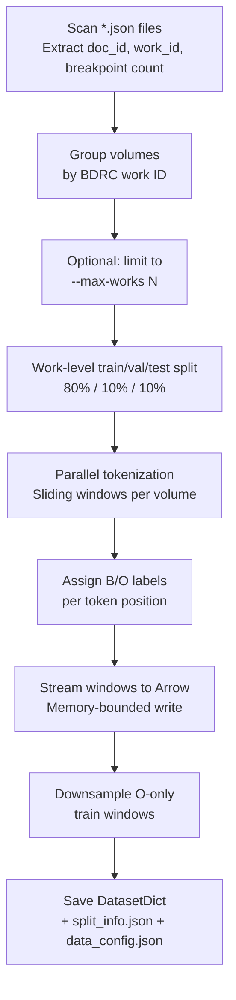

# Step 1 — Prepare Training Data

Converts per-volume annotated JSONs into a HuggingFace `DatasetDict` of fixed-length sliding windows, ready for mmBERT fine-tuning.

---

## Prerequisites

```bash
python -m venv .env
source .env/bin/activate
pip install -e .
```

The tokenizer (`jhu-clsp/mmBERT-base`) is downloaded from HuggingFace on first run — ensure network access or a populated HF cache.

Annotated volume JSONs must exist under `data/Annotated_jsons/` (or specify a custom path with `--data-dir`).

---

## Input format

Each `*.json` file in the annotated directory represents one volume and must contain three keys:

| Key | Type | Description |
|-----|------|-------------|
| `filename` | string | Volume identifier — **must match the file's stem** (e.g. `W22080_I1KG1574_001`) |
| `content` | string | Full UTF-8 text of the volume |
| `segments` | list | Objects with `span_start`, `span_end`, and `label` |

```json
{
  "filename": "W22080_I1KG1574_001",
  "content": "།བཀའ་འགྱུར་ལྟེ་བ།...",
  "segments": [
    { "span_start": 0,    "span_end": 312,  "label": "TEXT" },
    { "span_start": 312,  "span_end": 890,  "label": "TEXT" },
    { "span_start": 890,  "span_end": 1450, "label": "TEXT" }
  ]
}
```

**Breakpoints** are derived as the `span_start` of every segment after the first — so in the example above, positions `312` and `890` become boundary positions. The segment `label` field is not used for training labels.

> Mismatched filename: if `filename` does not match the JSON file's stem, workers will fail to re-open the file during tokenization. Keep them identical.

---

## How to run

**Default (full corpus):**
```bash
mmbert-boundary prepare-data
```

**Smoke test — subset of works, smaller windows:**
```bash
mmbert-boundary prepare-data --max-works 20 --max-length 512 --stride 128
```

**Custom paths and parallelism:**
```bash
mmbert-boundary prepare-data \
  --data-dir /path/to/Annotated_jsons \
  --output-dir /path/to/processed \
  --workers 8
```

---

## Pipeline



---

## Split policy

The corpus is split at the **work level**, not at the document level. A BDRC work ID is the prefix before the first `_` in the filename (e.g. `W22080_I1KG1574_001` → `W22080`). This prevents volumes from the same collected work leaking into multiple splits.

- **Train** (~80%): all volumes belonging to each train work
- **Val / test** (~10% each): one representative volume per work (the first in sorted order)

Split ratios (`TEST_RATIO = 0.10`, `VAL_RATIO = 0.10`) and the random seed (`SEED = 42`) are constants in [`src/mmbert_boundary/config.py`](../src/mmbert_boundary/config.py) and are not exposed as CLI flags.

---

## Labeling

Before tokenization, the text is **NFC-normalized** (`unicodedata.normalize("NFC", text)`).

Each breakpoint is expanded into a **character band** of `BOUNDARY_RADIUS` chars on each side (default `3`). Any token whose character span overlaps this band receives label `B = 1`; all other real tokens receive `O = 0`. Special tokens (`[CLS]`, `[SEP]`) and padding positions receive `-100` (ignored by the loss function).

```
breakpoint at char 312, radius=3  →  band covers chars 309–315
token covering chars 310–314      →  label = 1  (B)
token covering chars 316–320      →  label = 0  (O)
[CLS] / [SEP] / pad               →  label = -100
```

---

## CLI reference

| Flag | Default | Description |
|------|---------|-------------|
| `--data-dir` | `data/Annotated_jsons` | Directory of per-volume JSON files |
| `--output-dir` | `data/processed` | Where to write the prepared dataset and metadata |
| `--model-name` | `jhu-clsp/mmBERT-base` | HuggingFace tokenizer to use |
| `--max-length` | `8192` | Sliding-window size in tokens |
| `--stride` | `256` | Token overlap between consecutive windows |
| `--boundary-radius` | `3` | Char radius around each breakpoint labeled B |
| `--neg-sample-ratio` | `0.20` | Fraction of O-only train windows to keep |
| `--workers` / `-j` | `4` | Parallel tokenization processes |
| `--max-works` | _(none)_ | Limit to first N works; useful for dry runs |

Parameters not exposed as flags (edit `config.py` to change): `TEST_RATIO`, `VAL_RATIO`, `SEED`.

---

## Outputs

All outputs are written to `--output-dir` (default `data/processed/`):

| Path | Contents |
|------|----------|
| `dataset/` | HuggingFace `DatasetDict` with `train`, `validation`, `test` splits |
| `split_info.json` | Work IDs and doc IDs assigned to each split |
| `data_config.json` | Tokenization parameters and window/label counts used for this run |

`data/processed/` must exist before training, benchmark, and evaluate steps — none of them regenerate it.

---

## What one data point looks like

**One row in the dataset = one sliding window**, not one source volume. A long volume (e.g. 1 M characters) produces hundreds of windows; each window is an independent row.

### Fields

| Field | Type | Meaning |
|-------|------|---------|
| `input_ids` | `list[int]`, length `max_length` | Token IDs, padded to fixed length |
| `attention_mask` | `list[int]`, length `max_length` | `1` = real token, `0` = padding (model ignores these) |
| `labels` | `list[int]`, length `max_length` | `0` = O (non-boundary), `1` = B (boundary), `-100` = special/pad |
| `doc_id` | `string` | Volume identifier (e.g. `W22080_I1KG1574_001`) |

`attention_mask` is necessary because every window is padded to exactly `max_length` tokens. Shorter windows fill the remainder with pad IDs; without the mask, the model would treat pads as real content.

`boundary_char_positions` is computed during tokenization (used internally for counting), but it is **not saved** in the dataset.

### Illustrative example (abbreviated to length 8)

```python
{
  "doc_id":         "W22080_I1KG1574_001",
  "input_ids":      [2,  18492,  331,  55,  991,  0,    0,    0   ],
  "attention_mask": [1,  1,      1,    1,   1,    0,    0,    0   ],
  "labels":         [-100, 0,    1,    0,   0,    -100, -100, -100],
}
```

- Position 0 is `[CLS]` → `-100`
- Position 2 token (`331`) overlaps a boundary band → `1` (B)
- Positions 5–7 are padding → `attention_mask=0`, `labels=-100`

### Row ordering

Consecutive rows in the saved dataset are **not** guaranteed to be consecutive windows from the same document:

- During preparation, volumes are tokenized in parallel and written as they complete — arrival order is non-deterministic.
- For the train split, O-only windows are subsampled and the final keep-indices are **shuffled** before saving.

This does not affect training: the `DataLoader` already uses `shuffle=True`, so each window is treated as an independent example regardless of its position in the file.

---

## Tips and gotchas

**`--max-works` is not random.** It takes the first N works in sorted-filename order, then shuffles among those N to assign splits. Use it for reproducible dry runs, not random sampling.

**Double negative sampling.** Prepare downsamples O-only windows to `--neg-sample-ratio` (default 20%). The `train` step can downsample again at load time via its own `--neg-sample-ratio` (also default 20%). The H100 training example in the README uses `0.03` at train time. Be aware that the two ratios stack.

**Filename must match file stem.** Workers re-open source JSONs by constructing `data_dir / f"{doc_id}.json"` where `doc_id` comes from the `filename` field. If the JSON filename and `filename` field differ, the volume fails silently with an error log.

**RAM / workers.** Each worker loads a full tokenizer copy into memory. The default of 4 workers is conservative. Reduce to `--workers 1` if you hit OOM, or increase on machines with plenty of RAM.

**HuggingFace tokenizer download.** Workers call `AutoTokenizer.from_pretrained` once per process at startup. On a machine without internet access, pre-populate the HF cache before running `prepare-data`.

**Prepare on the training machine.** The padded windows (`max_length=8192`) make the processed dataset considerably larger than the raw JSONs. Prefer preparing on the same machine you will train on (e.g. a Vast.ai GPU box), then upload `data/processed/` to HuggingFace for documentation and reuse.

---

## Relation to later steps

| Step | What it consumes from `data/processed/` |
|------|-----------------------------------------|
| `sample-benchmark` | `dataset/test`, `split_info.json` |
| `train` | `dataset/train` and `dataset/validation` |
| `evaluate` | `dataset/test`, `split_info.json`, re-reads source JSONs |
