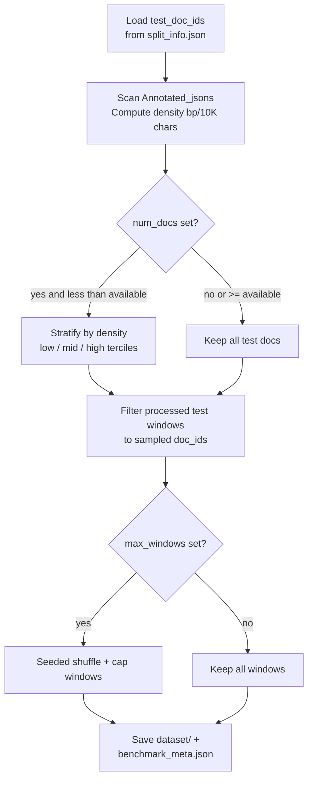

# Step 2 — Sample Benchmark

Builds an optional fixed subset of the **test** split, stratified by boundary density, for quick and consistent evaluation across experiments.

This step is optional. Skip it if you always evaluate on the full test set.

---

## Why this is not a re-split

Prepare’s 80 / 10 / 10 split and this step do different jobs:

| Step | What it does | Stratifies by? |
|------|--------------|----------------|
| `prepare-data` | Assigns **works** to train / val / test so training never sees held-out works | No — random work-level assignment (`SEED = 42`) |
| `sample-benchmark` | Optionally **subsets docs already in the test split** into a smaller fixed list | Yes — boundary density (low / mid / high terciles) |

`sample-benchmark` never touches train or val, and never reassigns works across splits. Density stratification only ensures a compact eval subset still covers sparse and dense volumes.

Use it for cheaper, repeatable comparisons (`evaluate --on-benchmark`). Revisit `--num-docs` / `--max-windows` once you know how large your test set is.

---

## Prerequisites

```bash
python -m venv .env
source .env/bin/activate
pip install -e .
```

`prepare-data` must already have been run. This step needs:

| Path | Role |
|------|------|
| `data/processed/split_info.json` | Supplies `test_doc_ids` |
| `data/processed/dataset/` | HuggingFace DatasetDict; the `test` split is filtered |
| `data/Annotated_jsons/{doc_id}.json` | Source text + segments for density stats |

Annotated and processed paths come from [`src/mmbert_boundary/config.py`](../src/mmbert_boundary/config.py) and are **not** exposed as CLI flags (unlike `prepare-data`).

---

## How to run

**Default — all test docs (no downsampling):**
```bash
mmbert-boundary sample-benchmark
```

**Compact benchmark — density-stratified doc sample + window cap:**
```bash
mmbert-boundary sample-benchmark --num-docs 30 --max-windows 500
```

**Custom output directory:**
```bash
mmbert-boundary sample-benchmark --output-dir /path/to/benchmark
```

> Evaluate’s `--on-benchmark` always reads `data/benchmark/benchmark_meta.json` (`BENCHMARK_DIR`). A custom `--output-dir` is only useful if you point evaluate at the same location later, or use the artifacts yourself.

---

## Pipeline



---

## Density

For each test document, the source JSON is NFC-normalized and breakpoints are derived the same way as in prepare: the `span_start` of every segment after the first.

```
density = num_breakpoints / max(text_length, 1) * 10000
```

Units are **breakpoints per 10,000 characters**. Docs missing from `Annotated_jsons/` (or unreadable) are skipped with a warning.

---

## Stratification

When `--num-docs` is set and smaller than the number of available test docs:

1. Sort docs by density ascending
2. Split into three terciles: low / mid / high (`n // 3` each; remainder lands in high)
3. Sample `num_docs // 3` from each bucket (`SEED = 42`)
4. If `num_docs` is not divisible by 3, fill the remainder from docs not yet sampled

If `--num-docs` is omitted (or ≥ available docs), every test doc with a readable source JSON is kept — no stratification runs.

---

## CLI reference

| Flag | Default | Description |
|------|---------|-------------|
| `--num-docs` | _(all test docs)_ | Target number of docs; triggers density stratification when smaller than available |
| `--max-windows` | _(none)_ | Cap total windows after doc filter (seeded shuffle, then take first N) |
| `--output-dir` | `data/benchmark` | Where to write `dataset/` and `benchmark_meta.json` |

Seed (`SEED = 42`) is fixed in `config.py` and not exposed as a flag.

---

## Outputs

All outputs are written to `--output-dir` (default `data/benchmark/`):

| Path | Contents |
|------|----------|
| `dataset/` | HuggingFace `Dataset` of test windows whose `doc_id` is in the sample (optionally window-capped) |
| `benchmark_meta.json` | Sample size, totals, and per-doc stats used by evaluate |

### `benchmark_meta.json` shape

```json
{
  "num_docs": 30,
  "num_unique_works": 30,
  "num_windows": 500,
  "total_breakpoints": 1842,
  "docs": [
    {
      "doc_id": "W22080_I1KG1574_001",
      "work_id": "W22080",
      "filename": "W22080_I1KG1574_001",
      "text_length": 412380,
      "num_breakpoints": 57,
      "density": 1.38
    }
  ]
}
```

Because prepare already keeps **one representative volume per test work**, `num_docs` and `num_unique_works` are usually equal.

### What evaluate actually uses

`mmbert-boundary evaluate --on-benchmark` reads **`benchmark_meta.json` plus the source JSONs** and runs full-document inference. It does **not** load `data/benchmark/dataset/` today. The saved window dataset is a filtered artifact of the same sample; the meta file is the contract that matters for evaluation.

---

## Tips and gotchas

**Optional by design.** Full-test evaluation still works without this step — omit `--on-benchmark` when calling `evaluate`.

**Pick sizes after you know the test set.** Defaults keep everything. Once you know how many test docs / windows you have, set `--num-docs` and optionally `--max-windows` for a stable, cheaper loop across training runs.

**`--max-windows` is not density-aware.** It shuffles all windows from the sampled docs and truncates. Long docs can dominate the remaining window count.

**Custom `--output-dir` vs evaluate.** Evaluate hardcodes `BENCHMARK_DIR` (`data/benchmark`). Write elsewhere only if you have a reason; for the standard workflow, leave the default.

**Missing source JSONs.** Test IDs listed in `split_info.json` but absent from `Annotated_jsons/` are skipped. Check the warning count if your sample looks smaller than expected.

**Re-run after re-preparing.** If you regenerate `data/processed/` with a different seed, corpus, or split, re-run `sample-benchmark` so the benchmark tracks the new test holdout.

---

## Relation to later steps

| Step | Relationship |
|------|----------------|
| `prepare-data` | Must run first; supplies `test_doc_ids` and the processed `test` split |
| `train` | Unaffected — uses train / validation only |
| `evaluate --on-benchmark` | Consumes `data/benchmark/benchmark_meta.json` (+ source JSONs) |
| `evaluate` (default) | Uses the full test set; ignores the benchmark |
