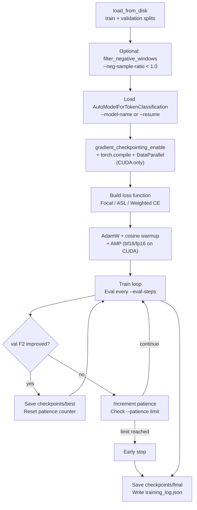

# Step 3 — Train

Fine-tunes mmBERT for Tibetan text boundary detection (token classification, B/O labels) with focal loss to handle the extreme class imbalance (~1:700 B:O ratio).

---

## Prerequisites

```bash
python -m venv .env
source .env/bin/activate
pip install -e .
```

`prepare-data` must already have been run. This step needs:

| Path | Role |
|------|------|
| `data/processed/dataset/train` | Windows with `input_ids`, `attention_mask`, `labels` |
| `data/processed/dataset/validation` | Same; used for eval and early stopping |

The base model (`jhu-clsp/mmBERT-base`) is downloaded from HuggingFace on first run — ensure network access or a warm HF cache.

A GPU is strongly preferred. Windows are padded to 8192 tokens; the default config uses `batch_size=1` with `grad_accumulation=16`. CPU/MPS runs are supported but very slow.

---

## Input format

Train loads the dataset with `datasets.load_from_disk`. The `test` split, `split_info.json`, and `data_config.json` produced by `prepare-data` are not read here.

Fields used per window:

| Field | Type | Used for |
|-------|------|----------|
| `input_ids` | `list[int]`, length `max_length` | Model input |
| `attention_mask` | `list[int]`, length `max_length` | Masking pad tokens |
| `labels` | `list[int]`, length `max_length` | `0`=O, `1`=B, `-100`=special/pad |
| `doc_id` | `string` | Loaded but ignored by collate |

---

## How to run

**Default (full corpus, single GPU):**
```bash
mmbert-boundary train
```

**Key flags:**
```bash
mmbert-boundary train \
  --epochs 5 \
  --batch-size 2 \
  --grad-accumulation 8 \
  --lr 2e-5 \
  --eval-steps 500 \
  --save-steps 500
```

**Resume from a checkpoint (weights only):**
```bash
mmbert-boundary train --resume output/checkpoints/best
```

**Recommended H100 config:**
```bash
mmbert-boundary train \
  --batch-size 8 --grad-accumulation 2 --epochs 5 \
  --eval-steps 200 --save-steps 600 --focal-gamma 3.0 \
  --neg-sample-ratio 0.03 --patience 15
```

**With Weights & Biases tracking:**
```bash
mmbert-boundary train --wandb
mmbert-boundary train --wandb --wandb-project my-project --wandb-run-name exp-focal-g3
```

---

## Pipeline



---

## Loss function and class imbalance

The dataset has approximately 1 boundary token per 700 non-boundary tokens. Three loss paths are available:

### Focal loss (default)

Down-weights easy O predictions so the model focuses on hard boundary tokens.

```
--focal-gamma 1.5   # focusing strength; increase (2.0–3.0) on large datasets
--focal-alpha 0.90  # B-class alpha; the complement (0.10) is assigned to O
```

If `--focal-alpha` is omitted it defaults to `0.90`. To derive alpha from the data ratio automatically, the fallback formula is `min(ratio / (1 + ratio), 0.99)` — but the hardcoded `0.90` is used unless you pass `None` explicitly.

### Asymmetric loss

Applies separate gamma values per class:

```bash
mmbert-boundary train --asymmetric-loss --asl-gamma-neg 3.0
```

Useful when focal loss produces too many false positives.

### Weighted cross-entropy

```bash
mmbert-boundary train --no-focal-loss
mmbert-boundary train --no-focal-loss --pos-weight 15
```

`--pos-weight` sets the B-class weight directly. If omitted, it is derived from the O:B ratio as `min(sqrt(ratio), 500)`. The README tuning tips (`pos-weight 15–20` for low recall, `5` for low precision) apply to this path only — they have no effect with focal loss.

---

## Negative window sampling

Prepare downsamples all-O windows to `--neg-sample-ratio` (default 20%). Train can downsample again at load time via its own `--neg-sample-ratio` (also default 20%). **These stack.**

Effective keep rate with both defaults: `0.20 × 0.20 = 4%` of the original O-only windows.

| Scenario | How to handle |
|----------|---------------|
| Prepared at default (20%), training on a large GPU | Set `--neg-sample-ratio 0.03` at train time (H100 example) |
| Already heavy prepare-time sampling | Set `--neg-sample-ratio 1.0` to skip train-time resampling |
| Fresh dataset, want maximum data | Set `--neg-sample-ratio 1.0` at both steps |

---

## Effective batch size

```
effective_batch = batch_size × grad_accumulation × n_gpu
```

| Config | Effective batch |
|--------|----------------|
| Default (`bs=1, ga=16, 1 GPU`) | 16 |
| H100 (`bs=8, ga=2, 1 GPU`) | 16 |
| 4× A100 (`bs=4, ga=4, 4 GPU`) | 64 |

Keep the effective batch constant when scaling GPUs by reducing `--grad-accumulation` proportionally.

---

## CLI reference

| Flag | Default | Description |
|------|---------|-------------|
| `--model-name` | `jhu-clsp/mmBERT-base` | Base model or HF path |
| `--data-dir` | `data/processed/dataset` | `load_from_disk` path |
| `--output-dir` | `output` | Root for checkpoints and logs |
| `--epochs` | `5` | Number of training epochs |
| `--batch-size` | `1` | Per-GPU batch size |
| `--eval-batch-size` | `2` | Batch size for validation |
| `--lr` | `2e-5` | AdamW learning rate |
| `--grad-accumulation` | `16` | Gradient accumulation steps |
| `--focal-loss` / `--no-focal-loss` | on | Use focal loss |
| `--focal-gamma` | `1.5` | Focal loss focusing parameter |
| `--focal-alpha` | `0.90` | B-class alpha for focal loss |
| `--asymmetric-loss` | off | Use ASL instead of focal |
| `--asl-gamma-neg` | `3.0` | ASL negative gamma |
| `--pos-weight` | auto | CE path only — manual B-class weight |
| `--resume` | `None` | Checkpoint path to reload weights from |
| `--eval-steps` | `200` | Run validation every N optimizer steps |
| `--save-steps` | `600` | Periodic checkpoint every N optimizer steps |
| `--patience` | `15` | Early stop after N evals without F2 gain |
| `--neg-sample-ratio` | `0.20` | Fraction of all-O windows to keep (`1.0` = keep all) |
| `--warmup-ratio` | `0.10` (or `0.02` if `--resume`) | LR warmup as fraction of total steps |
| `--compile` / `--no-compile` | on | `torch.compile` (CUDA only) |
| `--workers` | `4` | DataLoader worker processes |
| `--cost-per-hour` | `0.0` | Log estimated GPU cost in $/hr |
| `--wandb` | off | Enable W&B experiment tracking |
| `--wandb-project` | `Bo-boundary-mmbert` | W&B project name |
| `--wandb-run-name` | `None` | W&B run name (auto-named if omitted) |
| `--wandb-entity` | `None` | W&B entity (team or username) |

Parameters not exposed as flags — edit [`src/mmbert_boundary/config.py`](../src/mmbert_boundary/config.py) directly:

| Config constant | Value | Role |
|-----------------|-------|------|
| `WEIGHT_DECAY` | `0.01` | AdamW weight decay |
| `MAX_GRAD_NORM` | `1.0` | Gradient clipping |
| `SEED` | `42` | Global RNG seed |
| `WANDB_PROJECT` | `Bo-boundary-mmbert` | Default W&B project name |

---

## Outputs

All outputs land under `--output-dir` (default `output/`):

| Path | Contents |
|------|----------|
| `checkpoints/best/` | Best model by validation **F2** (`save_pretrained` + tokenizer) |
| `checkpoints/final/` | Weights after the last completed epoch |
| `checkpoints/checkpoint-{step}/` | Periodic saves every `--save-steps` |
| `training_log.json` | Per-eval and epoch-end metric history |
| `training.log` | Tee of full stdout/stderr |

### Metrics logged

Every eval (mid-epoch) and after each epoch:

| Key | Description |
|-----|-------------|
| `val_precision` | Boundary token precision |
| `val_recall` | Boundary token recall |
| `val_f1` | F1 score |
| `val_f2` | **F2 score — selection metric for best checkpoint** |
| `val_tp / val_fp / val_fn` | Raw token counts |
| `val_loss` | Validation loss |
| `train_loss` | Average train loss up to this eval |
| `step` / `epoch` | Position in training |
| `elapsed_s` | Wall-clock seconds since start |
| `cost_usd` | Estimated cost (if `--cost-per-hour > 0`) |

> **Note:** the internal variable tracking the best checkpoint is named `best_f1` in the code, but the actual selection criterion is **F2**. The `training_log.json` key is `val_f2`.

---

## Device behavior

| Device | AMP | `torch.compile` | Multi-GPU |
|--------|-----|-----------------|-----------|
| CUDA | bf16 (if supported) or fp16 | Enabled by default | `DataParallel` (auto, all detected GPUs) |
| MPS (Apple Silicon) | Not used | Not used | Not available |
| CPU | Not used | Not used | Not available |

AMP and `torch.compile` are gated on `device.type == "cuda"` in the code. MPS and CPU runs use full precision and compile is skipped silently.

---

## Weights & Biases tracking

W&B is optional. Pass `--wandb` to enable; all local outputs (`training_log.json`, `training.log`, checkpoints) are written regardless.

### One-time setup

```bash
wandb login          # prompts for API key; or set WANDB_API_KEY env var
```

### Enable per run

```bash
mmbert-boundary train --wandb
mmbert-boundary train --wandb --wandb-project my-project --wandb-run-name exp-g3-neg003
mmbert-boundary train --wandb --wandb-entity my-team
```

### Offline mode

```bash
WANDB_MODE=offline mmbert-boundary train --wandb
wandb sync wandb/                          # sync later when back online
```

### What gets tracked

**Config** (logged to run config on init):

All CLI hyperparameters plus effective batch size, device, GPU count, label counts, and dataset sizes.

**Per optimizer step:**

| W&B key | Description |
|---------|-------------|
| `train/loss` | Step loss (before grad accum averaging) |
| `train/lr` | Current learning rate |

**Per eval checkpoint (`--eval-steps`) and epoch end:**

| W&B key | Description |
|---------|-------------|
| `val/loss` | Validation loss |
| `val/precision` | Precision |
| `val/recall` | Recall |
| `val/f1` | F1 |
| `val/f2` | F2 (selection metric) |
| `val/tp`, `val/fp`, `val/fn` | Token counts |
| `train/loss_avg` | Average train loss (mid-epoch evals) |
| `train/loss_epoch` | Epoch average train loss (epoch-end only) |
| `epoch` | Current epoch |
| `cost_usd` | Estimated cost (if `--cost-per-hour > 0`) |

**Run summary** (set on finish):

| Key | Value |
|-----|-------|
| `best_f2` | Best val F2 achieved |
| `total_time_s` | Total wall-clock seconds |
| `best_checkpoint` | Path to `checkpoints/best/` |

---

## Tips and gotchas

**`--resume` reloads weights only.** Optimizer state, learning rate schedule, and `global_step` are not restored. The warmup ratio defaults to `0.02` (vs `0.10` fresh) to avoid a large LR spike on resume. Pass `--warmup-ratio 0` to skip warmup entirely on resume.

**Double negative sampling.** If `prepare-data` ran with default `--neg-sample-ratio 0.20` and train also uses the default `0.20`, only ~4% of the original O-only windows are seen. Intended for large datasets. For smaller corpora, set one or both ratios to `1.0`.

**OOM on CUDA.** Reduce `--batch-size` to 1 and increase `--grad-accumulation` to keep the effective batch constant. The default config already uses `batch_size=1`.

**Patience is in eval counts, not epochs.** `--patience 15` means 15 consecutive evaluations (triggered every `--eval-steps` steps) without F2 improvement. On a dataset where each epoch contains many evals, this can trigger within a single epoch.

**`torch.compile` first-run cost.** The first training step is slow while PyTorch traces and compiles the graph. This is normal — step times stabilize after a few iterations.

**`--focal-alpha` and the CE path.** `--focal-alpha` is only meaningful with `--focal-loss` (default). It is ignored when `--no-focal-loss` is set; use `--pos-weight` instead.

**Tokenizer on resume.** The tokenizer is always loaded from `--model-name`, not from the checkpoint directory. This is correct as long as you resume with the same base model.

**Workers and memory.** Each DataLoader worker loads a full tokenizer copy. Reduce `--workers 1` if you hit CPU RAM limits on machines with limited memory.

---

## Relation to later steps

| Step | Relationship to training |
|------|--------------------------|
| `prepare-data` | Must run first; supplies `dataset/train` and `dataset/validation` |
| `sample-benchmark` | Independent — only uses the test split; unaffected by training |
| `evaluate` | Consumes `output/checkpoints/best` (or any checkpoint); pass `--model output/checkpoints/best` |
| `predict` | Same checkpoint; pass `--model output/checkpoints/best` |
