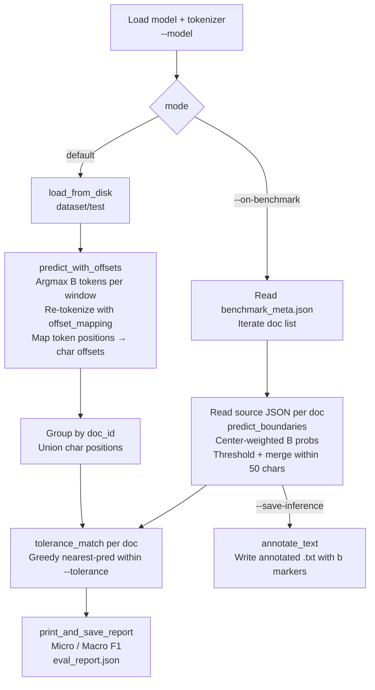

# Step 4 — Evaluate

Scores a trained checkpoint against ground-truth boundaries at the character level, using tolerance-based matching. Produces per-document and aggregate precision, recall, and F1.

> This is offline evaluation — not the token-level F2 used during training to select the best checkpoint. See [Step 3 — Train](03-train.md) for training-time metrics.

---

## Scope: whole-document evaluation

Evaluation always compares the **complete set of predicted boundary positions vs all true breakpoints** in each source volume. Sliding windows are a technical necessity for running the model on long texts — they are not evaluation windows over boundary-adjacent regions only.

Things that are **not** boundary crops:

| What | What it actually is |
|------|---------------------|
| Sliding inference windows | Full-text coverage; long volumes need many windows to be seen by the model at all |
| `--boundary-radius` in prepare | Training label radius around breakpoints — not an eval crop |
| ±50 char context in predict output | Display snippet in JSON / annotated text — not a scoring region |
| O-only window neg-sampling | Applied to the **train** split only; test/val windows are never dropped |

---

## Prerequisites

```bash
python -m venv .env
source .env/bin/activate
pip install -e .
```

A trained checkpoint must exist. This step needs:

| Path | Role | Required by |
|------|------|-------------|
| `output/checkpoints/best` | Trained model + tokenizer | Both modes |
| `data/processed/dataset/test` | Windowed test split | Default mode only |
| `data/processed/data_config.json` | Stride for token → char remapping | Default mode (fallback if absent: `min(128, max_length - 3)`) |
| `data/Annotated_jsons/{doc_id}.json` | Source text + ground-truth segments | Both modes |
| `data/benchmark/benchmark_meta.json` | Sampled doc list from `sample-benchmark` | `--on-benchmark` only |

`data/benchmark/dataset/` is **not** read by evaluate — the window dataset from `sample-benchmark` is an artifact for your own use. The meta file is the contract.

---

## How to run

**Default — full test set:**
```bash
mmbert-boundary evaluate --model output/checkpoints/best
```

**Benchmark subset (faster, repeatable across runs):**
```bash
mmbert-boundary evaluate --model output/checkpoints/best --on-benchmark
```

**Adjust tolerance:**
```bash
mmbert-boundary evaluate --model output/checkpoints/best --tolerance 20
```

**Benchmark with threshold tuning and annotated output:**
```bash
mmbert-boundary evaluate --model output/checkpoints/best --on-benchmark \
  --threshold 0.75 --save-inference output/inference_annotated
```

**Custom report path:**
```bash
mmbert-boundary evaluate --model output/checkpoints/best \
  --output output/runs/exp1_eval_report.json
```

---

## Pipeline



---

## Two evaluation modes

The two modes share the same scoring logic but differ in how they run inference:

| | Default (full test) | `--on-benchmark` |
|-|---------------------|-----------------|
| **Input data** | `data/processed/dataset/test` (pre-tokenized windows) | `benchmark_meta.json` doc list + source JSONs |
| **Inference** | Argmax over logits per token; B-labeled token char start → char offset set per doc | `predict_boundaries`: sliding windows, center-weighted B probs, thresholded, merged within 50 chars |
| **Threshold** | Not used (argmax) | `--threshold` (default `0.75`) |
| **`--save-inference`** | Ignored | Writes annotated `.txt` per doc |
| **`--batch-size`** | Controls DataLoader batch size | Not used (one doc at a time) |
| **Coverage** | All test documents in the processed dataset | Docs listed in `benchmark_meta.json` only |

Ground truth is the same for both: `span_start` of every segment after the first in the source JSON — identical to how `prepare-data` derived breakpoints.

### Why the inference differs

The default path uses pre-tokenized windows that already have `doc_id` attached and offset mappings can be recovered by re-tokenizing the source text. The benchmark path re-reads full source text and runs `predict_boundaries` (the same function as `mmbert-boundary predict`), which applies center-window probability weighting to reduce boundary noise near window edges.

---

## Tolerance matching

All scoring goes through `tolerance_match`:

1. For each true breakpoint, find the nearest unmatched predicted position within `--tolerance` chars (default `25`, from `TOLERANCE_CHARS` in `config.py`).
2. Greedy match — each predicted position is claimed at most once.
3. Per-doc: TP, FP, FN → precision, recall, F1.

Aggregate metrics across all documents:

| Metric | Definition |
|--------|------------|
| Micro precision | `total_TP / (total_TP + total_FP)` |
| Micro recall | `total_TP / (total_TP + total_FN)` |
| Micro F1 | Harmonic mean of micro P and R |
| Macro F1 | Mean of per-doc F1, only over docs where `total_true > 0` |

> Tolerance of 25 chars is generous enough to absorb Tibetan tokenizer boundary shifts and multi-byte character alignment differences without masking real misses. Tighten with `--tolerance 10` for stricter runs; loosen with `--tolerance 50` on noisy data.

---

## Window and row ordering

**Within one volume:** sliding windows are generated left-to-right over the full text (`return_overflowing_tokens=True`). Window 0 covers the beginning of the document, window 1 the next stride step, and so on.

**In the saved `dataset/test`:** rows are not one continuous pass through the corpus. Volumes are tokenized in parallel during `prepare-data` and written as they complete, so document blocks may arrive out of order. Within each document's block, windows are contiguous and in document order. The test and validation splits are **not** shuffled by prepare (unlike train, which is shuffled after neg-sampling).

**Consequence for evaluation:** `predict_with_offsets` groups predictions by `doc_id`, then indexes windows by their position in the per-doc list. It assumes window `i` in the dataset aligns with overflow window `i` from re-tokenizing the source text — valid because prepare writes each volume's windows together in sequence.

**Benchmark `--max-windows`:** shuffles window indices in `data/benchmark/dataset/` — irrelevant to `evaluate --on-benchmark`, which ignores that saved dataset entirely.

---

## Output

### Console

```
============================================================
EVALUATION RESULTS
============================================================
  Tolerance:          25 chars
  Documents:          87
  Total boundaries:   4821
  Total predicted:    4603
  ─────────────────────────────
  Micro Precision:    0.8741  (4026/4603)
  Micro Recall:       0.8350  (4026/4821)
  Micro F1:           0.8541
  Macro F1:           0.8214
  ─────────────────────────────
  True Positives:     4026
  False Positives:    577
  False Negatives:    795
============================================================

Per-document results (sorted by F1, worst first):
  W22080_I1KG1... P=0.612 R=0.500 F1=0.550 (12/24 boundaries)
  ...
```

The 10 worst-performing documents by F1 are always shown to guide debugging.

### `output/eval_report.json`

```json
{
  "config": {
    "model": "output/checkpoints/best",
    "tolerance": 25,
    "threshold": 0.75,
    "on_benchmark": false
  },
  "aggregate": {
    "micro_precision": 0.8741,
    "micro_recall": 0.8350,
    "micro_f1": 0.8541,
    "macro_f1": 0.8214,
    "total_tp": 4026,
    "total_fp": 577,
    "total_fn": 795,
    "total_predicted": 4603,
    "total_true": 4821,
    "num_documents": 87
  },
  "per_document": {
    "W22080_I1KG1574_001": {
      "precision": 0.875,
      "recall": 0.824,
      "f1": 0.849,
      "tp": 14,
      "fp": 2,
      "fn": 3,
      "total_predicted": 16,
      "total_true": 17
    }
  }
}
```

Match lists and FP/FN char positions are printed to console but not saved to the JSON.

### Annotated inference (`--save-inference`)

When `--save-inference <dir>` is set (benchmark mode only), each evaluated document is written to `<dir>/{doc_id}.txt` with `<b>` markers at every predicted boundary position.

---

## CLI reference

| Flag | Default | Description |
|------|---------|-------------|
| `--model` | `output/checkpoints/best` | Path to trained model directory |
| `--batch-size` | `2` | DataLoader batch size (default mode only; ignored with `--on-benchmark`) |
| `--tolerance` | `25` | Char distance within which a prediction counts as a match |
| `--threshold` | `0.75` | Confidence threshold for `predict_boundaries` (`--on-benchmark` only) |
| `--on-benchmark` | off | Use benchmark doc list instead of full test set |
| `--save-inference` | _(none)_ | Directory for annotated `.txt` output (`--on-benchmark` only) |
| `--output` | `output/eval_report.json` | Report destination |

---

## Tips and gotchas

**Train val F2 ≠ this report.** Training selects checkpoints by token-level F2 on validation windows. This step scores char-level micro/macro F1 on the test set. A model with high val F2 can still have lower char-level F1 due to tolerance effects, duplicate predictions within a tolerance window, or domain shift between val and test.

**`--threshold` and `--save-inference` are ignored in default mode.** They only apply to `--on-benchmark`. Passing them without `--on-benchmark` is silently ignored.

**Missing source JSON → doc skipped.** If `data/Annotated_jsons/{doc_id}.json` is absent for any test doc, that document is skipped with a warning. Check the warning count if your document total looks smaller than expected.

**Stride remapping.** Default mode re-tokenizes source text to get `offset_mapping`. It reads the stride from `data/processed/data_config.json` when available; otherwise falls back to `min(128, max_length - 3)`. If you prepared with a non-default stride and `data_config.json` is missing, char offset alignment will be wrong — keep `data_config.json` with the processed dataset.

**Custom benchmark `--output-dir`.** Evaluate hardcodes `BENCHMARK_DIR` (`data/benchmark`). If you ran `sample-benchmark --output-dir` somewhere else, `evaluate --on-benchmark` will not find it. Leave the default for the standard workflow.

**Running on a subset for debugging.** There is no `--max-docs` flag on evaluate. To quickly score a single document, use `mmbert-boundary predict` on the source text and compare manually, or run the full evaluate and check `per_document` in the JSON report.

---

## Relation to other steps

| Step | Relationship to evaluate |
|------|--------------------------|
| `prepare-data` | Supplies `dataset/test`, `split_info.json`, `data_config.json`, and source JSONs |
| `sample-benchmark` | Supplies `benchmark_meta.json` for `--on-benchmark`; optional |
| `train` | Supplies `output/checkpoints/best` (or any checkpoint directory) |
| `predict` | Runs the same model on new, unannotated text with no ground truth; see `05-predict.md` |
