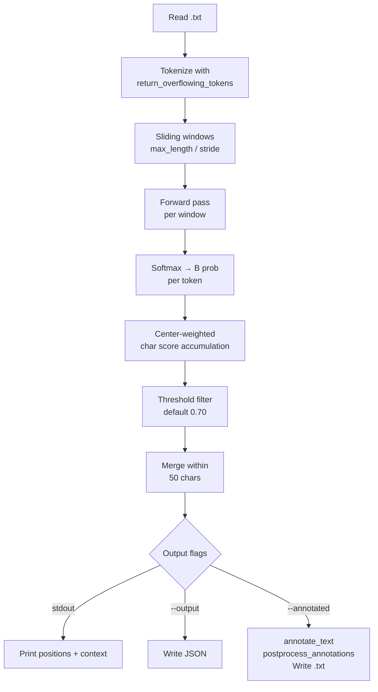

# Step 5 — Predict

Runs a trained mmBERT checkpoint on raw Tibetan `.txt` files and returns character-offset boundary positions. Optionally emits a JSON results file or a `<b>`-annotated copy of the text.

---

## Prerequisites

```bash
python -m venv .env
source .env/bin/activate
pip install -e .
```

A trained checkpoint must exist (default `output/checkpoints/best`). This step needs:

| Path | Role |
|------|------|
| `output/checkpoints/best/` | Trained model from `mmbert-boundary train`; any directory loadable by `AutoModelForTokenClassification.from_pretrained` works |
| One or more UTF-8 `.txt` files | Input text to segment |

No processed dataset or annotated JSONs are needed — predict works directly from raw text.

---

## Input format

Plain UTF-8 `.txt` files. The text is passed directly to the tokenizer; no pre-processing or normalisation is applied before inference.

**Directory mode** globs `*.txt` inside the given path (non-recursive). Files with other extensions are silently skipped.

---

## How to run

**Single file — print to stdout:**
```bash
mmbert-boundary predict input.txt
```

**Save boundaries as JSON:**
```bash
mmbert-boundary predict input.txt --output boundaries.json
```

**Save `<b>`-annotated text:**
```bash
mmbert-boundary predict input.txt --annotated output_annotated.txt
```

**Both outputs at once:**
```bash
mmbert-boundary predict input.txt \
  --output boundaries.json \
  --annotated output_annotated.txt
```

**Batch — process a directory:**
```bash
mmbert-boundary predict docs_folder/ \
  --output results/ \
  --annotated annotated/
```

**Explicit model path:**
```bash
mmbert-boundary predict input.txt --model output/checkpoints/checkpoint-1200
```

**Lower the threshold to catch more boundaries (higher recall, lower precision):**
```bash
mmbert-boundary predict input.txt --threshold 0.3
```

---

## Pipeline



### Center weighting

Each window contributes a weighted B probability to every character position it covers. Tokens at the window's centre receive full weight (`1.0`); tokens near the edges taper to `0.5`:

```
centre_dist = |token_idx - n_tokens/2| / (n_tokens/2)
weight      = 1.0 - 0.5 * centre_dist
```

The final score for a character position is the weighted mean of B probabilities across all windows that covered it:

```
char_score[pos] = Σ(weight * B_prob) / Σ(weight)
```

This smooths out edge artefacts — tokens with truncated left/right context are trusted less than tokens seen with full context in the window centre.

### Thresholding and merging

1. Keep all character positions with `char_score >= threshold`.
2. Sort by position and scan linearly: if two candidates are within **50 characters** of each other, keep the one with higher confidence and discard the other.
3. For each surviving position, record a context snippet of ±50 chars with a `|BOUNDARY|` marker.

---

## Annotated output and post-processing

`annotate_text` inserts `<b>` at each boundary offset by iterating positions in **reverse** order so earlier offsets stay valid as the string grows.

When `--annotated` is set, the CLI additionally runs `postprocess_annotations`, which nudges `<b>` markers to more natural Tibetan syllable/word boundaries:

| Rule | Effect |
|------|--------|
| `<b>` before shad clusters (། …) | Shifts `<b>` to after the shad |
| `<b>` before `)` | Shifts `<b>` to after the closing paren |
| `<b>` after ༄ (Yig mgo) | Shifts `<b>` to before ༄ |
| `<b>` after ༈ (Yig mgo mdun ma) | Shifts `<b>` to before ༈ |
| `<b>` between prefix consonant (འ མ ག ད བ) and following Tibetan syllable | Shifts `<b>` to before the prefix |

`postprocess_annotations` is **not** called by the Python API (`annotate_text` alone). If you use the API and need post-processing, call it explicitly:

```python
from mmbert_boundary.core.predict import postprocess_annotations
annotated = postprocess_annotations(annotate_text(text, boundaries))
```

Note: `postprocess_annotations` is not exported from the package `__init__`; import it directly from the module.

---

## Outputs

### Stdout (no `--output` / `--annotated`)

Single file: one line per boundary with position, confidence, and a context snippet.

Batch: a separator block per file showing filename, boundary count, and per-boundary summary.

### JSON (`--output`)

```json
{
  "file": "input.txt",
  "text_length": 12345,
  "num_boundaries": 42,
  "boundaries": [
    {
      "position": 100,
      "confidence": 0.9123,
      "context": "...preceding text |BOUNDARY| following text..."
    }
  ]
}
```

**Batch naming:** for a directory input, each file produces `{stem}_boundaries.json` under `--output`. The top-level array is not written; each file gets its own JSON.

### Annotated text (`--annotated`)

Single file: written to the given path.

**Batch:** each input file produces `{original_basename}` under `--annotated` (basename is preserved, not renamed).

---

## CLI reference

| Flag | Default | Description |
|------|---------|-------------|
| `input` | _(required)_ | Input `.txt` file **or** directory of `.txt` files |
| `--model` | `output/checkpoints/best` | Path to a trained model directory |
| `--output` | _(none)_ | JSON output path (single) or directory (batch) |
| `--annotated` | _(none)_ | Annotated `.txt` output path (single) or directory (batch) |
| `--threshold` | `0.70` | Minimum weighted B probability to emit a boundary |
| `--max-length` | `8192` | Sliding-window size in tokens |
| `--stride` | `256` | Token overlap between consecutive windows |

**Threshold surfaces:** the CLI default is `0.70`; the `predict_boundaries()` Python function default is `0.5`; `evaluate --on-benchmark` uses `0.75`. Always pass `--threshold` explicitly if you want the same value across surfaces.

---

## Python API

```python
from mmbert_boundary import predict_boundaries, annotate_text
from transformers import AutoModelForTokenClassification, AutoTokenizer
import torch

model = AutoModelForTokenClassification.from_pretrained("output/checkpoints/best")
tokenizer = AutoTokenizer.from_pretrained("output/checkpoints/best")
device = torch.device("cpu")

text = open("input.txt").read()

# predict_boundaries default threshold is 0.5 — set explicitly to match CLI
boundaries = predict_boundaries(text, model, tokenizer, device, threshold=0.70)
annotated = annotate_text(text, boundaries)
```

`predict_boundaries` returns the same list-of-dicts as the JSON output: `position`, `confidence`, `context`.

---

## Device behavior

`get_device()` selects `CUDA` → `MPS` → `CPU` in that order. The model is moved to the selected device and `model.eval()` is set before inference. All forward passes run under `torch.no_grad()`.

---

## Tips and gotchas

**Threshold controls the precision/recall trade-off.** The default `0.70` is tuned for moderate-density Tibetan texts. Lower it (e.g. `0.3`) to surface more candidates at the cost of more false positives; raise it to reduce noise.

**The merge window can collapse nearby true boundaries.** Two genuine boundaries within 50 characters of each other will be collapsed to the higher-confidence one. If your text has dense, closely-spaced boundaries, consider whether the merge window is appropriate.

**Annotated post-processing is CLI-only by default.** The `postprocess_annotations` nudges for Tibetan punctuation and prefix consonants only apply when using `--annotated`. The Python API does not run them automatically.

**Directory mode only picks up `.txt`.** Files with other extensions (e.g. `.tsv`, `.json`) inside the input directory are skipped without warning.

**No ground truth involved.** Predict has no concept of tolerance or matching against annotations — that is evaluate's job. Both steps share the same checkpoint.

---

## Relation to other steps

| Step | Relationship |
|------|-------------|
| `prepare-data` | Not required for predict |
| `sample-benchmark` | Not required for predict |
| `train` | Produces the checkpoint consumed by predict |
| `evaluate` | Shares `predict_boundaries` internally for `--on-benchmark`; uses a separate windowed path for dataset eval; both steps consume the same checkpoint |
